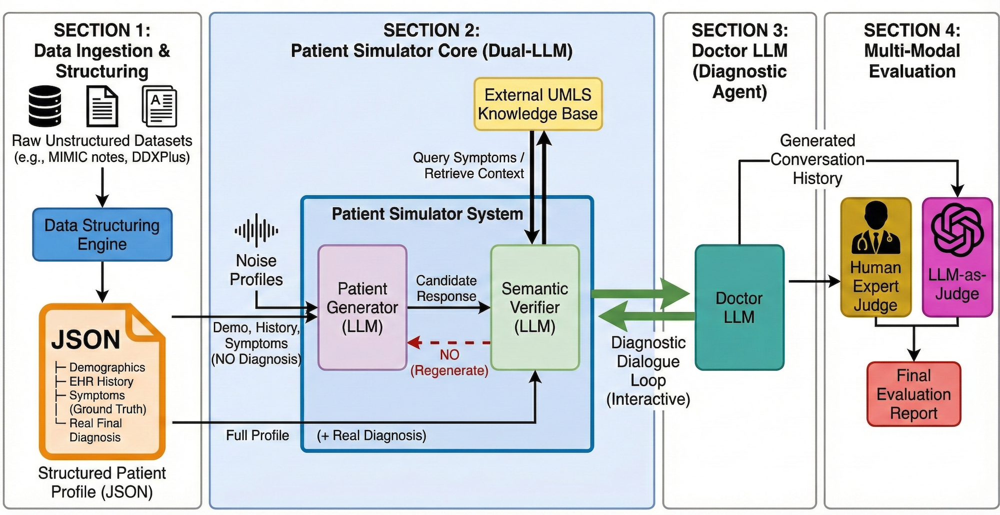

# TruthSim: Truth-Preserving Noisy Patient Simulator

[](https://opensource.org/licenses/MIT)
[](https://www.python.org/downloads/)

**A controllable framework for realistic medical AI evaluation through truth-preserving patient simulation.**

## Overview

Medical LLMs achieve impressive performance on standardized benchmarks, yet these evaluations fail to capture the complexity of real clinical encounters where patients exhibit memory gaps, limited health literacy, anxiety, and other communication barriers.

**TruthSim** addresses this gap by providing:
- 🎭 **Realistic Patient Simulation**: Six clinically-grounded noise dimensions
- ✅ **Truth Preservation**: Hybrid UMLS-LLM verification prevents hallucinations
- 🎛️ **Controllable Noise**: Fine-grained control over patient communication barriers
- 📊 **Comprehensive Evaluation**: Automated LLM-as-Judge + human evaluation support

## Key Features

| Feature | Description |
|---------|-------------|
| **Six Noise Pillars** | Memory & Recall, Health Literacy, Emotional State, Communication Style, Social-Cultural, Cognitive Processing |
| **Dual-LLM Architecture** | Separate Generator and Verifier for controlled noise injection |
| **UMLS Integration** | Semantic context extraction from SNOMED CT for medical grounding |
| **Zero Runtime Latency** | Pre-computed UMLS contexts eliminate API bottlenecks |
| **3.8% Hallucination Rate** | 6× reduction compared to unconstrained generation |

## Architecture

<p align="center">
  
</p>

**Overview:**
- **Phase 1 (Offline):** Patient cases are preprocessed through the UMLS API to extract semantic context, which is cached as JSON for zero runtime latency.
- **Phase 2 (Runtime):** The Generator produces noisy patient responses (without diagnosis access), while the Verifier validates them against UMLS context and ground truth diagnosis. Failed responses trigger regeneration.
- **Evaluation:** Completed conversations are evaluated using GPT-4o for diagnosis matching and LLM-as-a-Judge assessment.
## Installation

### 1. Clone the repository

```bash
git clone https://github.com/your-username/truthsim.git
cd truthsim
```

### 2. Create virtual environment

```bash
python -m venv venv
source venv/bin/activate  # On Windows: venv\Scripts\activate
```

### 3. Install dependencies

```bash
pip install -r requirements.txt
```

### 4. Set up environment variables

```bash
cp .env.example .env
# Edit .env with your API keys
```

**Required API Keys:**
- **UMLS API Key**: Get from [NLM UTS](https://uts.nlm.nih.gov/uts/signup-login)
- **OpenAI API Key**: For GPT-4o evaluation

## Quick Start

### Step 1: Preprocess UMLS Context (One-time)

```bash
python scripts/preprocess_umls.py \
    --input data/patient_cases/ \
    --output data/umls_cache/
```

### Step 2: Run Simulation

```bash
python scripts/run_simulation.py \
    --patients data/patient_cases/ \
    --umls_cache data/umls_cache/ \
    --doctor_model "meta-llama/Llama-3.1-70B-Instruct" \
    --output data/conversations/
```

### Step 3: Evaluate Results

```bash
python scripts/evaluate.py \
    --conversations data/conversations/ \
    --output data/evaluations/
```

## Data Format

### Patient Case (JSON)

```json
{
  "patient_id": "P001",
  "demographics": {
    "age": 45,
    "sex": "F"
  },
  "symptoms": [
    "chest pain",
    "shortness of breath",
    "sweating"
  ],
  "diagnosis": "Myocardial Infarction",
  "icd10_code": "I21.9",
  "noise_profile": [
    {"type": "memory", "level": 2},
    {"type": "health_literacy", "level": 3}
  ]
}
```

### Noise Levels (0-4)

| Level | Description |
|-------|-------------|
| 0 | Ideal patient (no noise) |
| 1 | Mild impairment |
| 2 | Moderate impairment |
| 3 | Significant impairment |
| 4 | Severe impairment |

## Six Noise Pillars

| Pillar | Clinical Basis | Example Behavior |
|--------|----------------|------------------|
| **Memory & Recall** | Patients forget 40-80% of medical info | "Maybe last week? Or two weeks ago?" |
| **Health Literacy** | 36% of US adults have limited literacy | Uses "sugar" for diabetes |
| **Emotional State** | Anxiety amplifies symptom perception | "I'm sure it's a heart attack!" |
| **Communication Style** | Varying ability for focused responses | Rambles about unrelated topics |
| **Social-Cultural** | Stigma leads to non-disclosure | Denies alcohol use initially |
| **Cognitive Processing** | Cyberchondria from internet research | "I read online this is Lupus" |

## Project Structure

```
truthsim/
├── config/
│   ├── config.yaml          # Hyperparameters
│   └── models.yaml          # Model configurations
├── data/
│   ├── patient_cases/       # Input patient JSONs
│   ├── umls_cache/          # Cached UMLS contexts
│   ├── conversations/       # Output transcripts
│   └── evaluations/         # Evaluation results
├── prompts/
│   ├── generator_prompt.txt
│   ├── verifier_prompt.txt
│   ├── doctor_prompt.txt
│   └── judge_prompt.txt
├── src/
│   ├── umls/                # UMLS extraction
│   ├── simulator/           # Patient simulator (Dual-LLM)
│   ├── doctor/              # Doctor LLM wrapper
│   ├── conversation/        # Conversation management
│   ├── evaluation/          # Evaluation pipeline
│   └── utils/               # Utilities
├── scripts/
│   ├── preprocess_umls.py
│   ├── run_simulation.py
│   └── evaluate.py
└── notebooks/
    └── analysis.ipynb
```

## Configuration

### Hyperparameters (`config/config.yaml`)

```yaml
conversation:
  max_turns: 15
  max_regeneration_attempts: 2
  response_word_limit: 50

temperature:
  generator: 0.7
  doctor: 0.3
  verifier: 0.0
  judge: 0.0

umls:
  synonyms_limit: 50
  variations_limit: 25
  relations_limit: 100
```

## Evaluation Metrics

| Metric | Description |
|--------|-------------|
| **Top-1 Accuracy** | Exact match with ground-truth diagnosis |
| **Top-3 Accuracy** | Ground truth in top 3 differentials |
| **Hallucination Rate** | % of responses with fabricated symptoms |
| **Consistency Rate** | % of responses without contradictions |
| **Realism Score** | Human/LLM rating (1-5 scale) |

## Results Summary

| Model | Clean Acc. | Noisy Acc. | Δ Accuracy |
|-------|------------|------------|------------|
| Qwen-2.5-72B | 84.5% | 69.2% | -15.3% |
| Llama-3.1-70B | 82.1% | 65.5% | -16.6% |
| Meditron-70B | 78.4% | 62.8% | -15.6% |
| Llama-3.1-8B | 61.8% | 40.2% | -21.6% |
| BioMistral-7B | 64.2% | 41.8% | -22.4% |

## Citation

```bibtex
@article{truthsim2025,
  title={Truth-Preserving Noisy Patient Simulator: A Controllable Framework for Realistic Medical AI Evaluation},
  author={Anonymous},
  journal={arXiv preprint},
  year={2025}
}
```

## License

This project is licensed under the MIT License - see the [LICENSE](LICENSE) file for details.

## Acknowledgments

- UMLS/SNOMED CT from the National Library of Medicine
- DDXPlus and MIMIC-IV-ED datasets

## Contact

For questions or issues, please open a GitHub issue or contact the authors.
